**Project Work**

**Topic : Attendance System using Facial Recognition**

**By : Srihari Thyagarajan (Haleshot)**

# Aim Of This Project

-   To create an automated attendance system which uses facial recognition system. In which the user has to first register himself by using the real time camera and then by using face recognition the attendance can be marked for that particular user. The basic idea is to create a system to replace the manual attendance system by paper and also the fingerprint scanning system. It is designed purposely to make more smarter and easier method to mark the attendance instead using the traditional methods. It can cater the needs for many companies and universities.

**Is This System Really Required?**

-   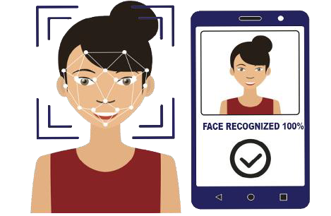As we already knew that fingerprint scanning technology is widely used by many companies and colleges till the time.
-   These were used as the standardized system for attendance but after the covid pandemic it was recommended to avoid physical contact at public places and objects.
-   It is not possible to sanitize the fingerprint machine after each person uses so by using facial recognition time clocking it helps to solve this problem.
-   A facial recognition time clocking system is a contactless technology that provides freedom from any physical interaction between the man and the machine.

# How Facial Recognition Works ?

-   A facial recognition software captures and compares patterns on a person’s face and analyses the details to identify and verify the individual. While the underlying system is complex, the whole technology can be broken down into three steps:
-   Face Detection: An essential step is locating human faces in real-time
-   Transform Data: Once captured, the analogue facial information is transformed into a set of data or vectors based on a person’s facial features
-   Face Match: The system matches the data above with the one in the database for verification

# Applications Of Facial Recognition System

-   **Attendance and Leave Management**: The most obvious application of these systems is for attendance recording and [leave management](https://truein.com/leave-management-system/). As these systems work on face identification, they are immune to malpractices like [buddy punching](https://truein.com/what-is-buddy-punching-and-how-to-prevent-it/) and timesheet manipulation.
-   **Access Control**: Face recognition time clock systems can also be used for access control applications, such as office access and computer login. These systems can also be programmed to monitor employees based on their facial identities.
-   **Surveillance**: Face recognition time clock systems can also have surveillance applications to boost the security of the premises. It is beneficial for securing large office spaces and identifying unauthorized personnel.

**Advantages Of Using Face Recognition System**

-   Almost every big tech company including Amazon, Google, Microsoft, and Cisco is leading the effort to make face recognition more mainstream. There are many reasons to adopt the technology.
-   Apart from being efficient, self-managed, and highly scalable, these systems offer unmatched advantages

Some of the major advantages of Facial Recognition System are :

-   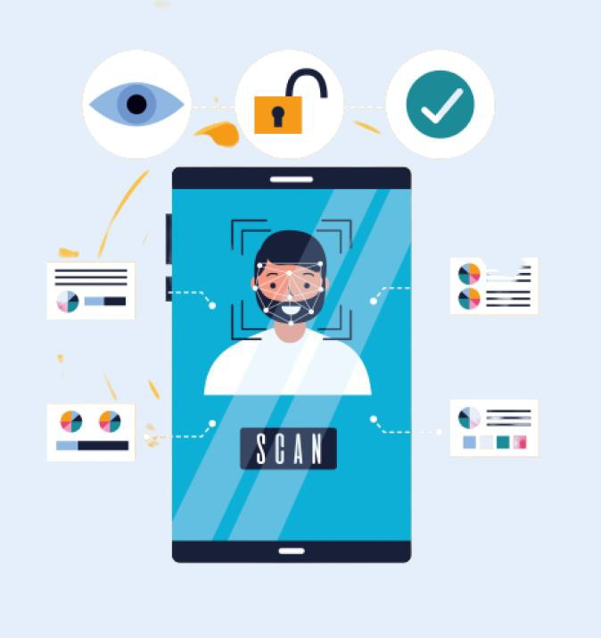Automated Time Tracking System
    -   Cost Effective
    -   Touchless Sign in System
    -   Facial Recognition with ageing and accessories
    -   More accurate and better Worker Attendance
    -   Easy To manage
    -   Smart Integration
    -   Strengthens security measures

# Disadvantages Of Face Recognition System

-   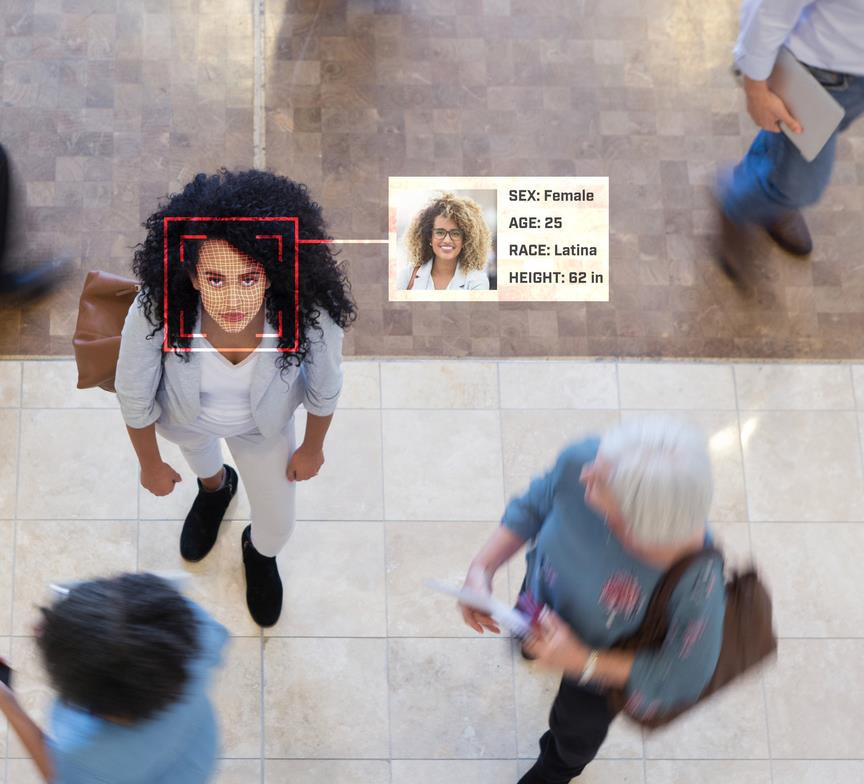Creates data vulnerabilities
    -   Provides opportunities for fraud and other crimes
    -   Technology can be fooled
    -   Can infringe on personal freedoms
    -   Violates personal rights

# Haar Cascades

-   It is an Object Detection Algorithm used to identify faces in an image or a real time video.
    -   Haar Cascade is a machine learning-based approach where a lot of positive and negative images are used to train the classifier.
    -   Haar Cascades can be used to detect any types of objects as long as you have the appropriate XML file for it. You can even create your own XML files from scratch to detect whatever type of object you want.
    -   These include models for face detection, eye detection, upper body and lower body detection, license plate detection etc.

# Working of Haar Cascades

-   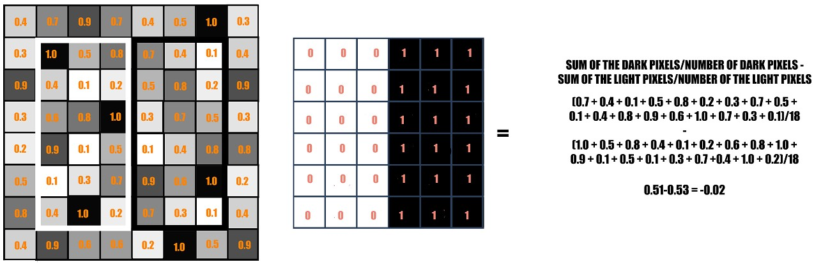A sample calculation of Haar value from a rectangular image section has been shown here.
-   The darker areas in the haar feature are pixels with values 1, and the lighter areas are pixels with values 0.
-   Each of these is responsible for finding out one particular feature in the image. Such as an edge, a line or any structure in the image where there is a sudden change of intensities.

-   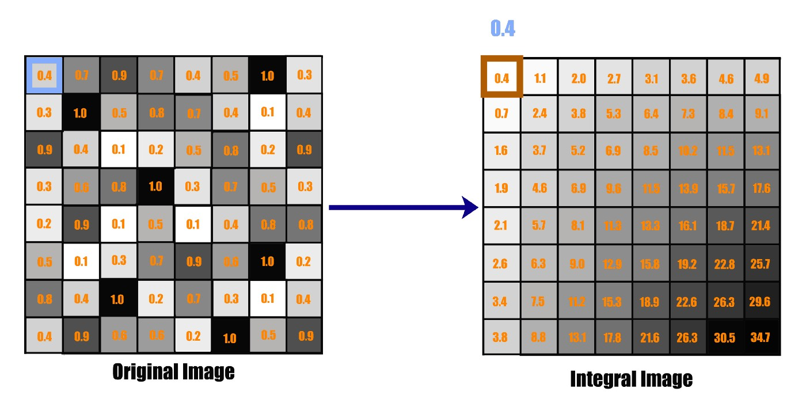Now, the haar features traversal on an image would involve a lot of mathematical calculations. As we can see for a single rectangle on either side, it involves 18 pixel value additions (for a rectangle enclosing 18 pixels).
    -   Imagine doing this for the whole image with all sizes of the haar features. This would be a hectic operation even for a high performance machine.
-   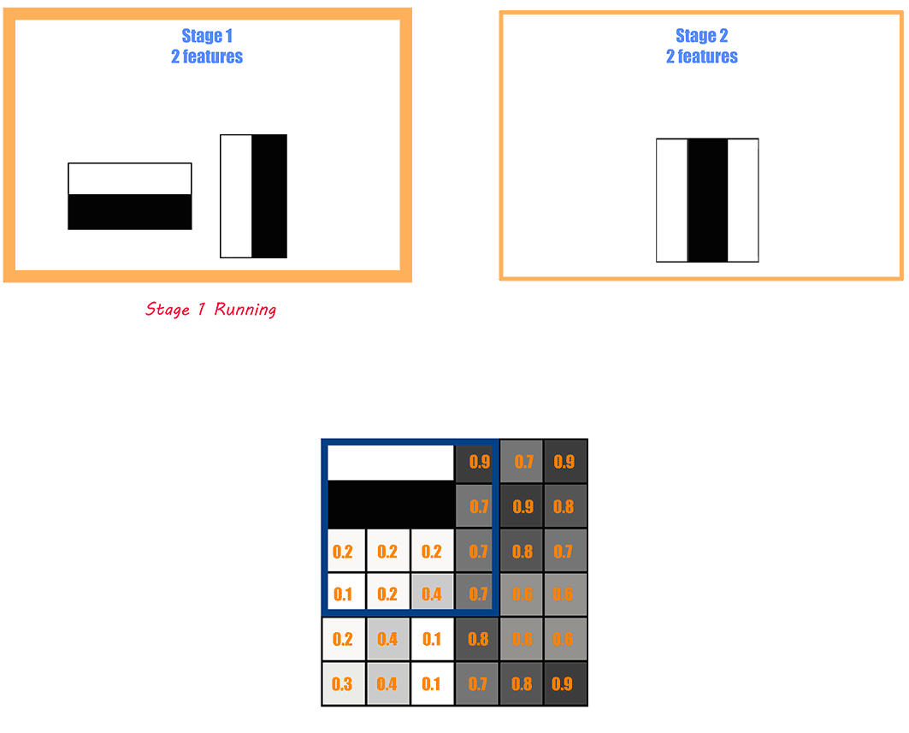Features are applied on the images in stages. The stages in the beginning contain simpler features, in comparison to the features in a later stage which are complex, complex enough to find the nitty gritty details on the face. If the initial stage won’t detect anything on the window, then discard the window itself from the remaining process, and move on to the next window. This way a lot of processing time will be saved, as the irrelevant windows will not be processed in the majority of the stages.
    -   The second stage processing would start, only when the features in the first stage are detected in the image. The process continues like this, i.e. if one stage passes, the window is passed onto the next stage, if it fails then the window is discarded.

# Glance Of GUI For Attendance System

image.png

# System Architecture

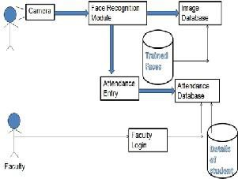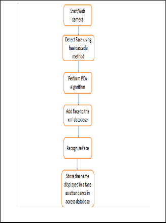

**Registering New User**

-   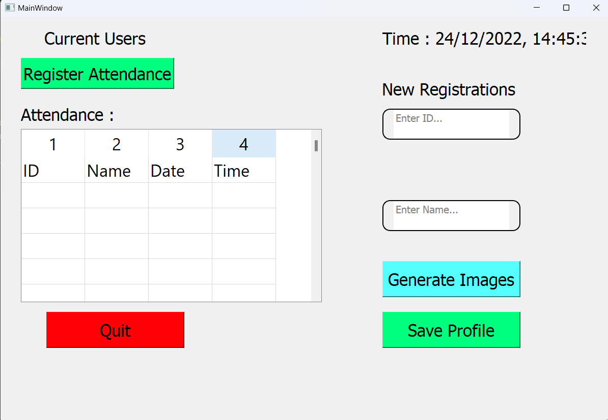While registering for a new user a real time camera pop up window appears and by using face detection it detects your face and creates a dataset folder which contains the images of the user.
-   The model recognises the user based on the dataset folder. The user can also register their roll number and name as details which can be displayed later on.

**Saving Profile For New User**

-   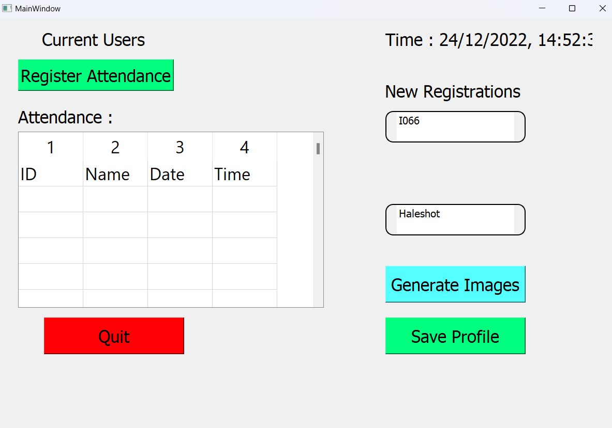After the face detection , the user enters the required data and then by clicking the save profile button it saves data for a particular user profiles.

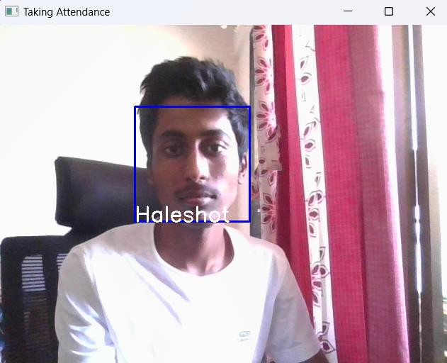**Marking Attendance**

-   After saving the profile the user can mark their attendance by clicking on the “Register Attendance” Button. The real time camera then pops up which will detect the face first and will check whether the user in front of the webcam matches with the data (images) stored In the dataset folder.

-   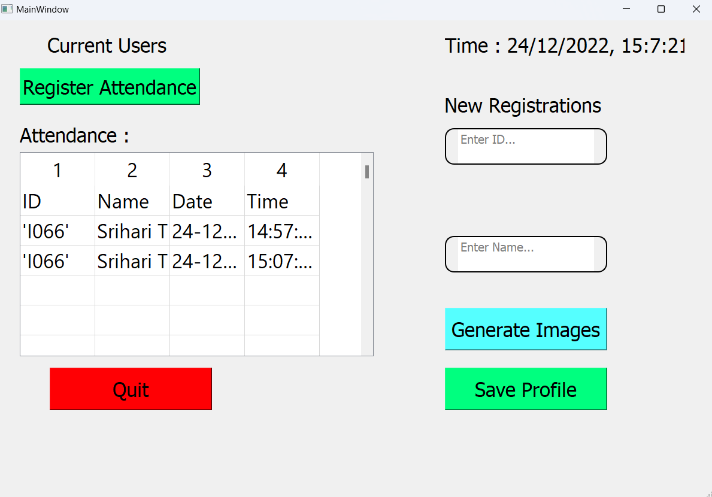If the images matches it will add data into a excel sheet which stores the user’s ID , Name , Date , Time and that data is played on the main window.

# Learning Outcomes From Project

Creating the project from scratch to working software, carrying out real-world software projects in our academic studies helped us to understand what we have to face in industry.

It was a wonderful experience working on Face Recognition Attendance System with enthusiastic and like-minded people wherein we explored a part of Artificial Intelligence, i.e. image processing, which relates to our system from capturing images, detecting faces, storing them in a dataset, extracting facial features, recognizing them and generating attendance through different algorithms.

Thank You!
